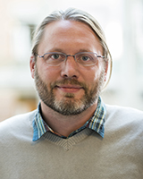

# Invited Speakers
+ [Joyce Y. Chai](#joyce_chai) (University of Michigan)
+ [H. V. Jagadish](#h_v_jagadish) (University of Michigan)
+ [Monica S. Lam](#monica_lam) (Stanford University)
+ [Percy Liang](#percy_liang) (Stanford University)
+ [Luke Zettlemoyer](#luke_zettlemoyer) (University of Washington & FAIR)
+ [Imed Zitouni](#imed_zitouni) (Google)

 

# Speaker Details

 [Joyce Y. Chai](http://www.cse.msu.edu/~jchai/)  (University of Michigan)

**Talk**: _Situated Human-Machine Communication_

**Bio**: Joyce Chai is a Professor in the Department of Computer Science and Engineering at University of Michigan. Prior to joining University of Michigan in 2020, she was a Professor at Michigan State University, where she was awarded the William Beal Outstanding Faculty Award in 2018, and before that she was a Research Staff Member at IBM T. J. Watson Research Center. She holds a Ph.D. in Computer Science from Duke University. Her research interests include natural language processing, situated dialogue agents, human-robot communication, artificial intelligence, and intelligent user interfaces. Her recent work is focused on situated language processing to facilitate natural communication with robots and other artificial agents. 

She served as Program Co-chair for the Annual Meeting of the Special Interest Group in Dialogue and Discourse (SIGDIAL) in 2011, the ACM International Conference on Intelligent User Interfaces (IUI) in 2014, and the Annual Meeting of the North America Chapter of Association of Computational Linguistics (NAACL) in 2015 and the the Annual Meeting of the Association for Computational Linguistics (ACL) in 2020. She received a National Science Foundation CAREER Award in 2004 and the Best Long Paper Award from the Annual Meeting of Association of Computational Linguistics (ACL) in 2010. 

 

 [H. V. Jagadish](https://web.eecs.umich.edu/~jag/) (University of Michigan)

**Talk**: _Natural Language in a Database Management System_

**Bio**: H. V. Jagadish is Bernard A Galler Collegiate Professor of Electrical Engineering and Computer Science at the University of Michigan in Ann Arbor, and Director of the Michigan Institute for Data Science.  Prior to 1999, he was Head of the Database Research Department at AT&T Labs, Florham Park, NJ.  Professor Jagadish is well known for his broad-ranging research on information management, and has approximately 200 major papers and 37 patents.

He is a fellow of the ACM, "The First Society in Computing," (since 2003) and of AAAS (since 2018).  He served on the board of the Computing Research Association (2009-2018). He has been an Associate Editor for the ACM Transactions on Database Systems (1992-1995), Program Chair of the ACM SIGMOD annual conference (1996), Program Chair of the ISMB conference (2005), a trustee of the VLDB (Very Large DataBase) foundation (2004-2009), Founding Editor-in-Chief of the Proceedings of the VLDB Endowment (2008-2014), and Program Chair of the VLDB Conference (2014). Since 2016, he is Editor of the Morgan & Claypool Synthesis Lecture Series on Data Management.  

Among his many awards, he won the ACM SIGMOD Contributions Award in 2013 and the David E Liddle Research Excellence Award (at the University of Michigan) in 2008. His popular MOOC on Data Science Ethics is available on both EdX and Coursera.

 

 [Monica S. Lam](https://suif.stanford.edu/~lam/) (Stanford University)

**Talk**: _Let's Build an Open Programmable Virtual Assistant with Privacy_

**Bio**: Monica Lam is a Professor in the Computer Science Department at Stanford University since 1988. She is the faculty director of the Open Virtual Assistant Lab (OVAL). She received a B.Sc. from University of British Columbia in 1980 and a Ph.D. in Computer Science from Carnegie Mellon University in 1987. Monica is a Member of the National Academy of Engineering and Association of Computing Machinery (ACM) Fellow. She is a co-author of the popular text Compilers, Principles, Techniques, and Tools (2nd Edition), also known as Dragon book.

She is the PI of the NSF Research Award "Autonomy and Privacy with Open Federated Virtual Assistants". This project combines machine learning, natural language processing, programming systems, distributed systems, human-computer interaction, blockchain technology to create an open-source assistant that promotes consumer privacy and open competition. Her Almond research project is the first virtual assistant that lets users share their digital assets easily in natural language, without disclosing any information to a third party. It receives Popular Science's Best of What's New Award in Security in 2019.

 

 [Percy Liang](https://cs.stanford.edu/~pliang/) (Stanford University)

**Talk**: _Reflections on Semantic Parsing and Learning from Users_

**Bio**: Percy Liang is an Associate Professor of Computer Science at Stanford University (B.S. from MIT, 2004; Ph.D. from UC Berkeley, 2011). His two research goals are (i) to make machine learning more robust, fair, and interpretable; and (ii) to make computers easier to communicate with through natural language. 

His awards include the Presidential Early Career Award for Scientists and Engineers (2019), IJCAI Computers and Thought Award (2016), an NSF CAREER Award (2016), a Sloan Research Fellowship (2015), and a Microsoft Research Faculty Fellowship (2014).

 

 [Luke Zettlemoyer](https://www.cs.washington.edu/people/faculty/lsz) (University of Washington & FAIR)

**Talk**: _Denoising Sequence-to-Sequence Pre-training_

**Bio**: Luke Zettlemoyer is a Professor in the Paul G. Allen School of Computer Science & Engineering at the University of Washington, and a Research Scientist at Facebook. His research focuses on empirical methods for natural language semantics, and involves designing machine learning algorithms; introducing new tasks and datasets; and, most recently, studying how to best develop self-supervision signals for pre-training. Honors include multiple paper awards, a PECASE award, and an Allen Distinguished Investigator Award. Luke received his PhD from MIT and was a postdoc at the University of Edinburgh.

 

 [Imed Zitouni](https://www.linkedin.com/in/imed-zitouni-78819a2/) (Google)

**Talk**: _Toward Better Natural Language Interfaces: Leveraging the Power of Web Documents for QA_

**Bio**: Imed Zitouni is a director of engineering at Google leading efforts on NLU to enable capabilities for Semantic Search and Assistant leveraging the power of the Knowledge Graph. Before joining Google in 2019, Imed was at Microsoft leading the NLU and the Conversation Engine effort for the digital assistant Cortana. Prior to joining Microsoft in 2012, Imed was a Senior Researcher at IBM Watson for almost a decade, working on several NLP initiatives including the Watson initiative around informatics extraction, language modeling and automatic machine translation. Prior to IBM, Imed was a research member at Bell Labs, Lucent Technologies, for half a dozen years working on speech recognition, language modeling and spoken dialog systems. 

Imed received his M.Sc. and Ph.D. from the University-of-Nancy1 and INRIA in France. He also obtained a MEng degree in computer science from ENSI in Tunisia. Imed is the Editor-in-Chief of ACM Transactions on Asian and Low-Resources Language Processing. He is a senior member of IEEE, served as a board member of the IEEE Speech and Language Processing Technical Committee, and is the associate editor of IEEE Trans. on Audio, Speech and Language Processing. He is also the Information Officer of the ACL SIG on Semitic-Languages and served as chair as well as reviewing-committee-member of several conferences and journals. Imed is the author/co-author of two books, half-dozen book-chapters as well as more than 100 patents and scientific papers.

 